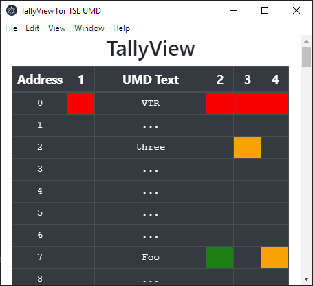

<!-- PROJECT SHIELDS -->
<!--
*** I'm using markdown "reference style" links for readability.
*** Reference links are enclosed in brackets [ ] instead of parentheses ( ).
*** See the bottom of this document for the declaration of the reference variables
*** for contributors-url, forks-url, etc. This is an optional, concise syntax you may use.
*** https://www.markdownguide.org/basic-syntax/#reference-style-links
-->
[![Contributors][contributors-shield]][contributors-url]
[![Forks][forks-shield]][forks-url]
[![Stargazers][stars-shield]][stars-url]
[![Issues][issues-shield]][issues-url]
[![MIT License][license-shield]][license-url]

<!-- PROJECT LOGO -->
<br />
<p align="center">

  <h3 align="center">TallyView</h3>

  <p align="center">
    Viewer for TSL UMD Tallies, V3.1 and V4
    <br />
    <a href="https://github.com/roddypratt/tallyview"><strong>Explore the docs »</strong></a>
    <br />
    <br />
    ·
    <a href="https://github.com/roddypratt/tallyview/issues">Report Bug</a>
    ·
    <a href="https://github.com/roddypratt/tallyview/issues">Request Feature</a>
  </p>
</p>


<!-- TABLE OF CONTENTS -->
## Table of Contents

* [About the Project](#about-the-project)
  * [Built With](#built-with)
* [Getting Started](#getting-started)
* [Roadmap](#roadmap)
* [Contributing](#contributing)
* [License](#license)
* [Contact](#contact)

<!-- ABOUT THE PROJECT -->
## About The Project

TallyView gives a live view of UMD text and tallies received using the TSL UMD protocol, either V3.1 or V4.

TallyView receives UDP messages on port 40001 ( currently hardwired), and automatically detects both V3.1 and V4 protocol variants. V4 packets with bad checksums are ignored. 



### Built With

* [TypeScript]()
* [Electron]()
* [Bootstrap]()
* [JQuery]()

<!-- GETTING STARTED -->
## Getting Started

Download the latest release for a pre-built installer for Mac, Windows or Linux. 

If you want to tweak the code
 
1. Clone the repo
```sh
git clone https://github.com/roddypratt/tallyview.git
```
2. Install packages
```sh
yarn 
```
3. Build and run!
```sh
yarn dev 
```

<!-- ROADMAP -->
## Roadmap

See the [open issues](https://github.com/roddypratt/tallyview/issues) for a list of proposed features (and known issues).


<!-- CONTRIBUTING -->
## Contributing

Contributions are what make the open source community such an amazing place to be learn, inspire, and create. Any contributions you make are **greatly appreciated**.

1. Fork the Project
2. Create your Feature Branch (`git checkout -b feature/AmazingFeature`)
3. Commit your Changes (`git commit -m 'Add some AmazingFeature'`)
4. Push to the Branch (`git push origin feature/AmazingFeature`)
5. Open a Pull Request


<!-- LICENSE -->
## License

Distributed under the ISC License. See `LICENSE` for more information.


<!-- CONTACT -->
## Contact

Project Link: [https://github.com/roddypratt/tallyview](https://github.com/roddypratt/tallyview)


<!-- MARKDOWN LINKS & IMAGES -->
<!-- https://www.markdownguide.org/basic-syntax/#reference-style-links -->
[contributors-shield]: https://img.shields.io/github/contributors/roddypratt/tallyview.svg?style=flat-square
[contributors-url]: https://github.com/roddypratt/tallyview/graphs/contributors
[forks-shield]: https://img.shields.io/github/forks/roddypratt/tallyview.svg?style=flat-square
[forks-url]: https://github.com/roddypratt/tallyview/network/members
[stars-shield]: https://img.shields.io/github/stars/roddypratt/tallyview.svg?style=flat-square
[stars-url]: https://github.com/roddypratt/tallyview/stargazers
[issues-shield]: https://img.shields.io/github/issues/roddypratt/tallyview.svg?style=flat-square
[issues-url]: https://github.com/roddypratt/tallyview/issues
[license-shield]: https://img.shields.io/github/license/roddypratt/tallyview.svg?style=flat-square
[license-url]: https://github.com/roddypratt/tallyview/blob/master/LICENSE.txt
